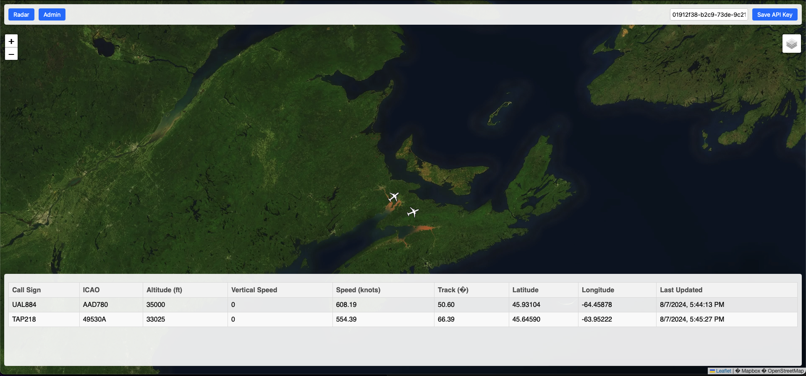

# RadarIngestSystem

## Overview

RadarIngestSystem is a project written in Dyalog APL designed for ingesting and managing ADS-B raw data from multipule antenna sources. The system allows for the parsing and agrigation of multipule antenna sources. Written with reference of [The 1090 Megahertz Riddle](https://mode-s.org/decode/misc/preface.html).

## Opening RIS

1. Open Dyalog APL.
2. Navigate to the project folder.
3. Run the following usercommand to open the project:
    ```apl
    ]cider.openproject .
    ```

## Running RIS

To start the RadarIngestSystem, you must first create an instance of the RIS class:
```apl
    ris←RadarIngestSystem.RIS.New 30001 ⍝ 30001 is the default port that this server should run on
Initial API Key: 01912f41-b152-76f6-ad50-72ea7f45e1bc
```

Radar Servers can be added:
```apl
    ris.AddServer '192.168.2.14:30002'
```

Finally, the server can be started:

```apl
    ris.Start
Start[3] 2024-08-07 @ 20.42.10.635 - Starting  Jarvis  1.16.3 
LoadConga[32] 2024-08-07 @ 20.42.10.644 - Conga copied from /Applications/Dyalog-19.0.app/Contents/Resources/Dyalog/ws/conga
LoadConga[44] 2024-08-07 @ 20.42.10.645 - Local Conga v5.3 reference is #._tatin.dyalog_Jarvis_1_16_3.Jarvis.[LIB]
Start[83] 2024-08-07 @ 20.42.10.646 - Jarvis starting in "JSON" mode on port 8080
Start[84] 2024-08-07 @ 20.42.10.646 - Serving code in #.RadarIngestSystem.[RIS].[Namespace]
Start[85] 2024-08-07 @ 20.42.10.647 - Click http://192.168.236.18:8080 to access web interface
```

This starts all of the functionalities (Web UI, Server Connections, and Client Listener) of RIS. To access the Web UI, click on the link in the logs, and then enter the Initial API Key in the API Key field of the UI. 

For additional map layer functionality (such as satellite mapping), add a map key from [mapbox.com](http://mapbox.com/) to the RIS instance:

```
ris.MapKey←'MAPKEY'
```



## Stopping RIS

To stop the RIS instance, run the following:
```apl
ris.Stop
```

## Database Schema

The database of planes is stored in a matrix format, where each row represents a plane. The columns correspond to different parameters as described below:

| Index | Column Name                          | Description |
|-------|--------------------------------------|-------------|
| 0     | ICAO                                 | Transponder Hex Code |
| 1     | cs                                   | Plane's call sign |
| 2     | ct                                   | Vector of two numbers that are indices in `genCatTable` |
| 3     | clate                                | Even Latitude Computing Value |
| 4     | clato                                | Odd Latitude Computing Value |
| 5     | clone                                | Even Longitude Computing Value |
| 6     | clono                                | Odd Longitude Computing Value |
| 7     | et                                   | Even time |
| 8     | ot                                   | Odd time |
| 9     | lat                                  | Latitude |
| 10    | lon                                  | Longitude |
| 11    | alt                                  | Altitude |
| 12    | gclate                               | Ground clate |
| 13    | gclato                               | Ground clato |
| 14    | gclone                               | Ground clone |
| 15    | gclono                               | Ground clono |
| 16    | get                                  | Ground et |
| 17    | got                                  | Ground ot |
| 18    | track                                | Track |
| 19    | speed                                | Speed |
| 20    | tracktype                            | Track type (1: Magnetic, 0: GNSS) |
| 21    | speedtype                            | Speed type (0: GS, 1: IAS, 2: TAS) |
| 22    | ifrcap                               | IFR Capability |
| 23    | vertrate                             | Vertical rate |
| 24    | diffGNSSBaro                         | Difference between GNSS and Barometric altitude |
| 24    | LastUpdate                           | Last time a message was received |

Note that the even and odd information contained within the database is for computational purposes, as one needs both an even and odd frame to calculate the latitude and longitude. 

In the future, a proper GUI could be implemented, however the main purpose of this will be to create a REST API to use as the backend of RadarPlane.com. 

## License

This project is licensed under the MIT License. See the LICENSE file for details.